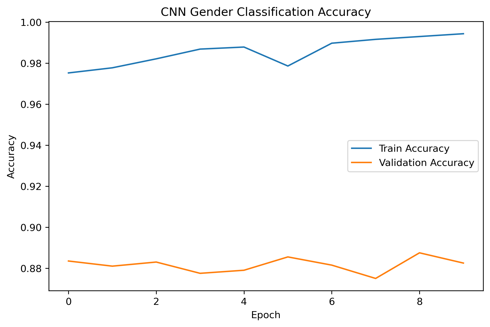
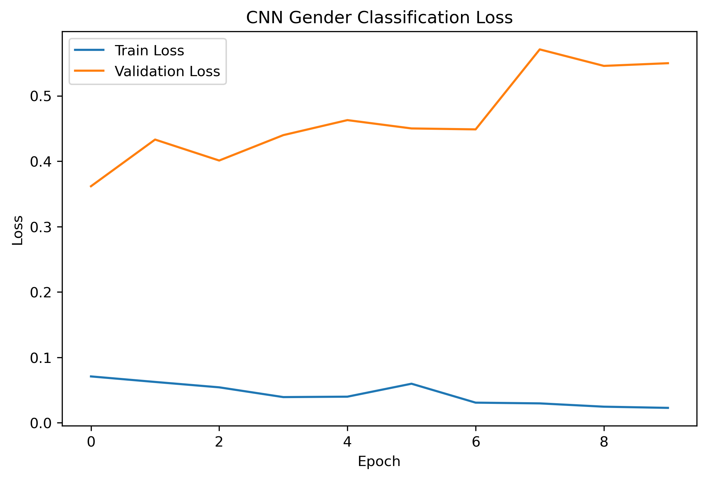

# Gender Detection using CNN

## Overview

A deep learning based gender detection system trained on the UTKFace dataset.

## Dataset

- UTKFace
- 23,708 face images

## Technologies

- Python
- OpenCV
- TensorFlow
- Keras
- NumPy
- Pandas
- Streamlit

## Model Architecture

CNN:

Conv2D → MaxPool → Conv2D → MaxPool → Dense → Output

## Results

| Model | Accuracy |
|---------|---------:|
| OpenCV Pretrained | 84.0% |
| Custom CNN | 88.25% |

## Training Accuracy

## Training Loss

## Features

- Upload image
- Predict gender
- Confidence score
- Web interface

## Future Improvements

- Age prediction
- Face detection
- Real-time webcam support
- Mobile deployment